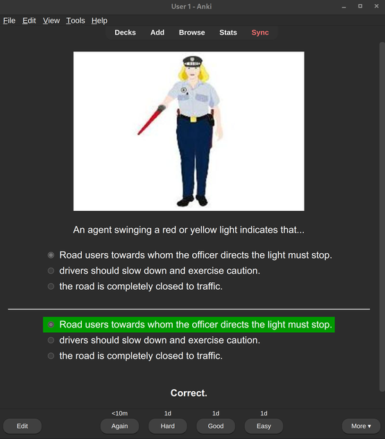

# Anki Spanish Drivers Test in English

This is based on the [Anki-Carnet-B](https://github.com/donmerendolo/anki-carnet-B) project.

## How I imported and processed donmerendolo's deck

1. I imported @donmerendolo's Spanish apkg file, then exported it to JSON using [CrowdAnki](https://ankiweb.net/shared/info/1788670778). The exported file, still in Spanish, is [anki-carnet-es.json](anki-carnet-b-en/anki-carnet-b-en.json).
1. Next I translated it with [attranslate](https://github.com/fkirc/attranslate). The simple script for the translation is [spanish_to_english.sh](spanish_to_english.sh). The translated English file is [anki-carnet-b-english.json](anki-carnet-b-en/anki-carnet-b-en.json). You will need a GCloud account and API key if you are to re-run this script.
1. Finally, I imported the English json file with CrowdAnki.

Alternatively, here is the apkg file with my translation and a few edits:
[anki-carnet-b-en.apkg](https://github.com/bike-bill/anki-carnet-B-english/raw/master/anki-carnet-b-en.apkg)

## Download Anki

<https://apps.ankiweb.net/>

## Necessary addon

You have to install the addon [Multiple Choice for Anki](https://ankiweb.net/shared/info/1566095810), with the code 1566095810.

## Mistakes

- There are some repeated questions.
- There are some translation issues, for example Google Translate makes "silenciador de explosiones" --> "explosion silencer" instead of "muffler" :joy:
